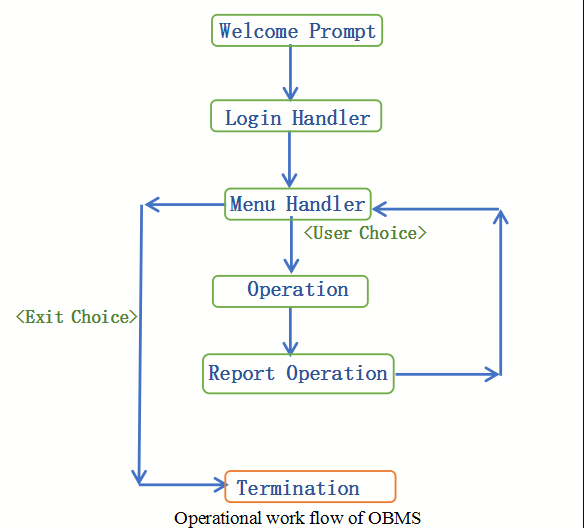

# CS 513 Software Systems Mini Project - OBMS
$$Title:\ \  Design\  and\ Development\ of\ Online\ Banking\ Management\ System\ (OBMS)$$
$\bigstar$ Project Goal: To develop a banking management system which is user-friendly and multi functional 
(as specified in Project Description, Reference: <a href="https://iiitbac-my.sharepoint.com/:b:/g/personal/boppana_venkatesh_iiitb_ac_in/EcQK-nE5hIVGq1gRtiPuFREBCUhx7QMWPTDrTH2OehJ5iw?e=vEONVo">link</a> )

This project mainly deals with concurrent banking operations in a safe and secure environment. 
The term ‘safe’ refers to consistent transaction management system especially when used by Joint Account holders (to avoid race conditions). 
The term ‘secure’ refers to authorized Access by Users (Admin/ Customer) and no other person can view/ access the data of concern. 

$\bigstar$ Features of OBMS are listed as follows: 
Handling multiple connections. i.e., Serving multiple clients simultaneously. 
Socket programming is used to implement client-server model. 
TCP connection for effective and reliable communication. 
Storage/ Database: Unix File System. i.e., data is stored typically in files only.  
Concurrency: 
File Locking (both mandatory and advisory locking) while operating files for consistency. 
Semaphores protection as mutex/ binary locks for Critical Section of the code especially while adding new transactions, accounts, etc., 
Only system calls are used directly, avoiding use of library functions.  
System calls related to process management,  file management, file locking, multi-threading and inter process communication mechanisms were used. 
Password protected login system for both admins and customers. 
 
$\bigstar$ Functionalities:
	
Admin Module: Administrator after successful login, able to do the following operations 
1.Add new Customer Details, 
2.Add new Accounts (Regular or Joint) for the above generated customers, 
3.View the Customer Details, 
4.View the Account Details, 
5.Activate and Block Accounts for Transaction hold/ block 
6.Update/ Modify the Account, Customer Details.  

Customer Module: Customer after login, can do any of these operations, 
1.Add New Transaction ( Deposit/ Withdraw ), 
2.View Transactions generated above, 
3.Update Password, 
4.Check the balance(s) of all the accounts he/she had. 

